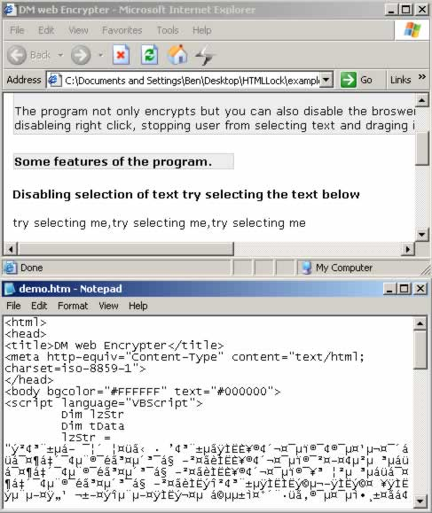



## DM HTML Encrypt

### Description

Hi,

Ok this sourcecode will allow you to encrypt your HTML files, you can also select options to disable right click, Selecting text and disable draging items.

Now the encryption only uses XOR but I guess you guys can add your own in. anyway I left a demo.htm files in the example folder for you to test. hope you find some use for it.
 
### More Info
 

             |
---                |---
**Submitted On**   |2003-12-09 16:32:26
**By**             |[dreamvb](https://github.com/Planet-Source-Code/PSCIndex/blob/master/ByAuthor/dreamvb.md)
**Level**          |Beginner
**User Rating**    |4.9 (39 globes from 8 users)
**Compatibility**  |VB 5\.0, VB 6\.0
**Category**       |[Internet/ HTML](https://github.com/Planet-Source-Code/PSCIndex/blob/master/ByCategory/internet-html__1-34.md)
**World**          |[Visual Basic](https://github.com/Planet-Source-Code/PSCIndex/blob/master/ByWorld/visual-basic.md)
**Archive File**   |[DM\_HTML\_En1758696182004\.zip](https://github.com/Planet-Source-Code/dreamvb-dm-html-encrypt__1-54448/archive/master.zip)

